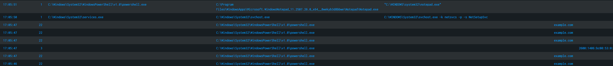

# 🧩 Lab 1: Correlating Sysmon Events in Splunk
**Date:** 2025-10-31 17:05 (UTC-5)

---

### 🎯 Objective  
Demonstrate the detection of correlated Sysmon activity: a PowerShell process creating Notepad, performing a DNS query, and establishing a network connection. The goal is to validate that Sysmon and Splunk are successfully configured to capture process, network, and DNS telemetry.

---

### ⚙️ Tools Used  
- **Sysmon v14+** (schema 4.90)  
- **Splunk Enterprise** (Windows index)  
- **Sysmon Configuration:** `sysmon_lab.xml`  

---

### 🔍 SPL Query Used
```spl
index=windows (EventCode=1 OR EventCode=3 OR EventCode=22) earliest=-4h
| eval QueryName=coalesce(QueryName,"")
| eval DestinationIp=coalesce(DestinationIp,"")
| table _time EventCode Image ParentImage CommandLine QueryName DestinationIp
| sort - _time
```

---

### 🧪 Execution Steps  
1. Opened PowerShell (normal user).  
2. Executed the following **three commands** to generate correlated Sysmon logs:
   ```powershell
   nslookup example.com            # EventCode 22 - DNS query
   curl http://example.com         # EventCode 3  - Network connect (HTTP)
   Start-Process notepad.exe       # EventCode 1  - Process creation
   ```
3. Verified EventCodes **1 (Process Create)**, **3 (Network Connection)**, and **22 (DNS Query)** appeared in Splunk within the configured time window.

---

### 📊 Results  
| EventCode | Description | Observation |
|------------|--------------|-------------|
| **1** | Process Creation | PowerShell spawned `notepad.exe` |
| **22** | DNS Query | PowerShell resolved `example.com` |
| **3** | Network Connection | PowerShell connected to an Akamai IPv6 endpoint |

---

### 🖼️ Screenshot Evidence  
 


---

### ✅ Conclusion  
Sysmon successfully captured correlated activity between process creation, DNS resolution, and network connections. Splunk accurately indexed and displayed the events through a combined query, confirming full visibility for endpoint detection use cases.
