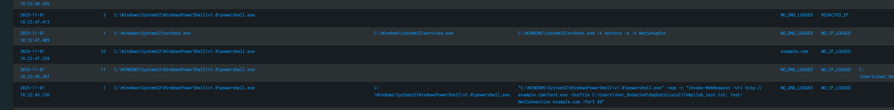

🧪 Lab 2: Correlating Multi-Stage PowerShell Activity in Splunk

Date: 2025-11-01 (UTC-5)

🎯 Objective

Demonstrate successful correlation of Sysmon event telemetry within Splunk, showing a single PowerShell process performing file creation, DNS resolution, and outbound network activity. This validates Sysmon’s ability to capture and correlate multi-stage process behavior for endpoint detection use cases.

🧰 Tools Used

Sysmon v14.0

Splunk Enterprise (Windows index)

Sysmon Configuration: sysmon_lab.xml

🔍 SPL Query Used:
index=windows source="XmlWinEventLog:Microsoft-Windows-Sysmon/Operational" (EventCode=1 OR EventCode=3 OR EventCode=11 OR EventCode=22) earliest=-60m
| eval Image=if(isnotnull(Image), replace(Image,"C:\\\\Users\\\\[^\\\\]+","C:\\\\Users\\\\User_Redacted"), Image)
| eval ParentImage=if(isnotnull(ParentImage), replace(ParentImage,"C:\\\\Users\\\\[^\\\\]+","C:\\\\Users\\\\User_Redacted"), ParentImage)
| eval CommandLine=if(isnotnull(CommandLine), replace(CommandLine,"C:\\\\Users\\\\[^\\\\]+","C:\\\\Users\\\\User_Redacted"), CommandLine)
| eval TargetFilename=if(isnotnull(TargetFilename), replace(TargetFilename,"C:\\\\Users\\\\[^\\\\]+","C:\\\\Users\\\\User_Redacted"), TargetFilename)
| eval DestinationIp=if(isnull(DestinationIp),"NO_IP_LOGGED",
    replace(DestinationIp,"\\b(?:(?:\\d{1,3}\\.){3}\\d{1,3}|[0-9A-Fa-f:]+)\\b","REDACTED_IP"))
| eval QueryName=if(isnull(QueryName),"NO_DNS_LOGGED",
    replace(QueryName,"[A-Za-z0-9.-]+\\.[A-Za-z]{2,}","example.com"))
| where NOT match(Image,"(?i)splunk|sysmon")
| table _time EventCode Image ParentImage CommandLine QueryName DestinationIp TargetFilename
| sort 0 - _time

⚙️ Execution Steps

Opened PowerShell (Run as Administrator).

Executed the following combined command to generate all correlated Sysmon logs from a single process:

powershell -nop -c "Invoke-WebRequest -Uri http://example.com/test.exe -OutFile $env:TEMP\lab_test.txt; Test-NetConnection example.com -Port 80"

EventCode 1: Process creation (powershell.exe)

EventCode 11: File creation (lab_test.txt)

EventCode 22: DNS query (example.com)

EventCode 3: Network connection (REDACTED_IP)

Verified all four correlated events appeared within a short time window under the same PowerShell PID in Splunk.

📊 Results
EventCode	Description	Observation
1	Process Creation	PowerShell process started
3	Network Connection	Outbound TCP connection to example.com (REDACTED_IP)
11	File Creation	PowerShell wrote lab_test.txt to Temp
22	DNS Query	PowerShell resolved example.com

🖼️ Screenshot Evidence

🧩 Conclusion

Sysmon successfully captured and correlated PowerShell’s behavior across process creation, file modification, DNS resolution, and network activity.

Splunk’s query confirmed visibility into all stages of execution, validating that Sysmon and Splunk are properly configured for endpoint telemetry correlation.

