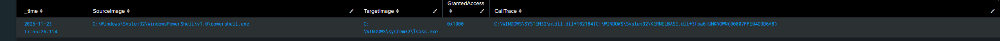

\# 🧩 Lab 5: Detecting Credential Access (Sysmon Event ID 10)

\*\*Date:\*\* 2025-11-23 (UTC-8)


---


\## 🎯 Objective

Detect credential access attempts by monitoring process access to LSASS.exe using Sysmon Event ID 10.


\*\*MITRE ATT\&CK:\*\* T1003.001 — OS Credential Dumping: LSASS Memory


---


\## 🧰 Tools Used

\- Sysmon v14.x

\- Splunk Enterprise (Windows index)

\- PowerShell (Get-CimInstance cmdlet)


---


\## 🔍 SPL Query Used

```spl

index=windows EventCode=10 TargetImage="\*lsass.exe" earliest=-30m

| rex mode=sed field=SourceImage "s/C:\\\\\\\\Users\\\\\\\\\[^\\\\\\\\]+/C:\\\\\\\\Users\\\\\\\\User\_Redacted/g"

| eval GrantedAccess=coalesce(GrantedAccess, "UNKNOWN")

| table \_time SourceImage TargetImage GrantedAccess CallTrace

| sort - \_time

```


---


\## 🧪 Execution Steps

1\. Verified Event ID 10 enabled in Sysmon config (ProcessAccess monitoring)

2\. Executed `Get-CimInstance Win32\_Process -Filter "Name='lsass.exe'"` in PowerShell (Administrator)

3\. Queried Splunk for LSASS access events

4\. Analyzed GrantedAccess values to identify access patterns


---


\## 📊 Results


| \_time | SourceImage | TargetImage | GrantedAccess |

|-------|-------------|-------------|---------------|

| 2025-11-23 14:XX:XX | C:\\Windows\\System32\\WindowsPowerShell\\v1.0\\powershell.exe | C:\\Windows\\system32\\lsass.exe | 0x1000 |





---


\## 🔍 Analysis


\### GrantedAccess Value: 0x1000

\- \*\*Meaning:\*\* PROCESS\_QUERY\_LIMITED\_INFORMATION

\- \*\*Behavior:\*\* PowerShell queried basic LSASS process information

\- \*\*Risk Level:\*\* Low - Standard administrative enumeration


\### Observed Baseline Activity

During testing, legitimate Windows processes were also observed accessing LSASS:

\- \*\*svchost.exe\*\* - Routine authentication services

\- \*\*Windows Defender\*\* - Real-time protection scanning


This demonstrates the importance of \*\*behavioral baselining\*\* in SOC operations. Multiple legitimate processes access LSASS daily, requiring analysts to distinguish between:

\- Administrative tools (PowerShell, Task Manager)

\- Security software (Antivirus, EDR)

\- Malicious tools (Mimikatz, credential dumpers)


\### Detection Indicators

\*\*Suspicious GrantedAccess values to investigate:\*\*

\- `0x1410` (PROCESS\_VM\_READ) - Memory reading capability

\- `0x1fffff` (PROCESS\_ALL\_ACCESS) - Full process control

\- `0x1010` (Common in Mimikatz operations)


---


\## ✅ Conclusion

Sysmon successfully detected process access to LSASS via Event ID 10. By monitoring GrantedAccess field values and correlating with source processes, analysts can identify potential credential dumping attempts while filtering out legitimate administrative and security tool activity.


This detection capability is critical for identifying post-exploitation activity and preventing credential theft in enterprise environments.


