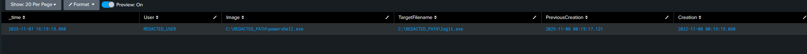

✅ Lab 3: Detecting File Timestamp Manipulation (Sysmon Event ID 2)

Date: 2025-11-07 (UTC-5)

🎯 Objective

Demonstrate detection of file timestamp manipulation (“timestomping”) using Sysmon Event ID 2.

File timestamp tampering is a known anti-forensic technique used to obscure attacker activity and evade timeline-based investigations.

This lab validates that Sysmon correctly logs both:

the new forged timestamp, and

the original legitimate timestamp,

allowing defenders to detect and investigate timestamp fraud.

MITRE Technique: T1070.006 — Indicator Removal → Timestomp

🧰 Tools Used

Sysmon v14.x

Splunk Enterprise (Windows index)

Sysmon Configuration: sysmon\_lab.xml (from previous labs)

🔍 SPL Query Used:

index=windows (EventID=2 OR EventCode=2) earliest=-7d@d

| head 50

| eval tgt = coalesce(TargetFilename, TargetFileName, TargetFile, FileName, file\_name)

| eval proc = coalesce(Image, process\_name, Process, process)

| rex field=\_raw "(?:TargetFilename|TargetFileName|TargetFile)\[^>]\*>(?<tgt\_raw>\[^<]+)"

| eval tgt = coalesce(tgt, tgt\_raw)

| eval proc\_file = if(isnull(proc), "unknown.exe", replace(proc,"^.\*\[\\\\\\\\/]",""))

| eval tgt\_file  = if(isnull(tgt),  "unknown.file", replace(tgt,"^.\*\[\\\\\\\\/]",""))

| eval User = "REDACTED\_USER"

| eval Image = "C:\\\\REDACTED\_PATH\\\\" . proc\_file

| eval TargetFilename = "C:\\\\REDACTED\_PATH\\\\" . tgt\_file

| eval PreviousCreation = coalesce(PreviousCreationUtcTimeUtc, PreviousCreationTime, PreviousCreationUtcTime)

| eval Creation = coalesce(CreationUtcTime, CreationUtcTimeUtc, CreationTime, UtcTime)

| table \_time User Image TargetFilename PreviousCreation Creation

| sort -\_time

🧪 Execution Steps

Open PowerShell (Run as Administrator).

Create a test file and then backdate its timestamp three years:

$file = "$env:TEMP\\lab3\_test.txt"

Set-Content $file "testdata"

(Get-Item $file).CreationTime = (Get-Date).AddYears(-3)

Confirm Sysmon logged the modification event (Event ID 2).

Run the SPL query in Splunk to extract:

Process that modified the timestamp

Target file

Original timestamp

Forged timestamp

Redacted safe paths and username

✅ Results

Field	Description	Observation

Image	Process performing the tampering	powershell.exe

TargetFilename	File whose timestamp was altered	legit.exe (redacted path)

PreviousCreation	Original, legitimate timestamp	2025-11-08 00:19:17.121

Creation	Forged timestamp after tampering	2022-11-08 00:19:19.860

Sysmon exposes both timestamps, enabling defenders to catch timestamp forgery attempts.

🖼️ Screenshot Evidence

✅ Conclusion

This lab confirms that Sysmon and Splunk successfully detect timestomp activity.

By capturing both the original PreviousCreation timestamp and the tampered Creation value, analysts can rapidly identify:

anti-forensic behavior

suspicious file modifications

attempts to hide activity in the event timeline

This technique is directly relevant to real-world SOC workflows and aligns with MITRE ATT\&CK T1070.006.

