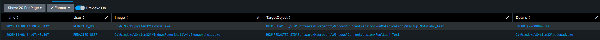

# 🧩 Lab 4: Detecting Registry Persistence (Sysmon Event ID 13)

**Date:** 2025-11-08 (UTC-5)

---

### 🎯 Objective
Demonstrate detection of persistence mechanisms through Windows Registry Run key modifications, using **Sysmon Event ID 13**.  
This lab validates that Sysmon accurately logs and Splunk successfully correlates registry modifications commonly used for startup persistence.

**MITRE ATT&CK Technique:** T1547.001 — Boot or Logon Autostart Execution: Registry Run Keys

---

### 🧰 Tools Used
- **Sysmon v14.x**  
- **Splunk Enterprise** (Windows index)  
- **Sysmon Configuration:** `sysmon_lab.xml` (same as previous labs)

---

### 🔍 SPL Query Used (Redacted)
```spl
index=windows (EventCode=13 OR EventID=13)
| eval User=if(isnotnull(User), "REDACTED_USER", "REDACTED_USER")
| eval Image=if(isnotnull(Image), replace(Image,"C:\\Users\\[^\\]+","C:\\Users\\User_Redacted"), Image)
| eval TargetObject=if(isnotnull(TargetObject), replace(TargetObject,"S-1-5-[0-9-]+","REDACTED_SID"), TargetObject)
| eval TargetObject=replace(TargetObject,"(?i)\\software\\microsoft\\windows\\currentversion\\run","\\Software\\Microsoft\\Windows\\CurrentVersion\\Run")
| eval Details=if(match(Details,"C:\\Users\\[^\\]+"), replace(Details,"C:\\Users\\[^\\]+","C:\\Users\\User_Redacted"), Details)
| where like(lower(TargetObject), "%\\software\\microsoft\\windows\\currentversion\\run%") 
      AND NOT like(lower(TargetObject), "%microsoftedgeautolaunch%")
| table _time User Image TargetObject Details
| sort - _time
```

---

### 🧪 Execution Steps

1. **Created a benign persistence entry** under the current user Run key using PowerShell:
   ```powershell
   New-ItemProperty -Path "HKCU:\Software\Microsoft\Windows\CurrentVersion\Run" `
     -Name "Lab4_Test" -Value "C:\Windows\System32\notepad.exe"
   ```
2. **Validated Sysmon Event ID 13** appeared in Splunk within seconds.  
3. **Removed** the test entry afterward to clean up:
   ```powershell
   Remove-ItemProperty -Path "HKCU:\Software\Microsoft\Windows\CurrentVersion\Run" -Name "Lab4_Test"
   ```

---

### 📊 Results

| Time (UTC-5) | User | Image | TargetObject | Details |
|---------------|------|--------|---------------|----------|
| 2025-11-08 14:08:05 | REDACTED_USER | C:\Windows\System32\sihost.exe | HKU\REDACTED_SID\Software\Microsoft\Windows\CurrentVersion\RunNotification\StartupTNotiLab4_Test | DWORD (0x00000001) |
| 2025-11-08 14:07:48 | REDACTED_USER | C:\Windows\System32\WindowsPowerShell\v1.0\powershell.exe | HKU\REDACTED_SID\Software\Microsoft\Windows\CurrentVersion\Run\Lab4_Test | C:\Windows\System32\notepad.exe |



---

### ✅ Conclusion
Sysmon successfully detected registry modifications under the **Run key**, confirming detection of persistence behavior.  
Splunk correlation demonstrated visibility of both legitimate and test entries, while redaction maintained operational security.

This lab verifies that Sysmon telemetry can identify **startup persistence techniques**, completing the foundation for endpoint visibility in a SOC workflow.

---
